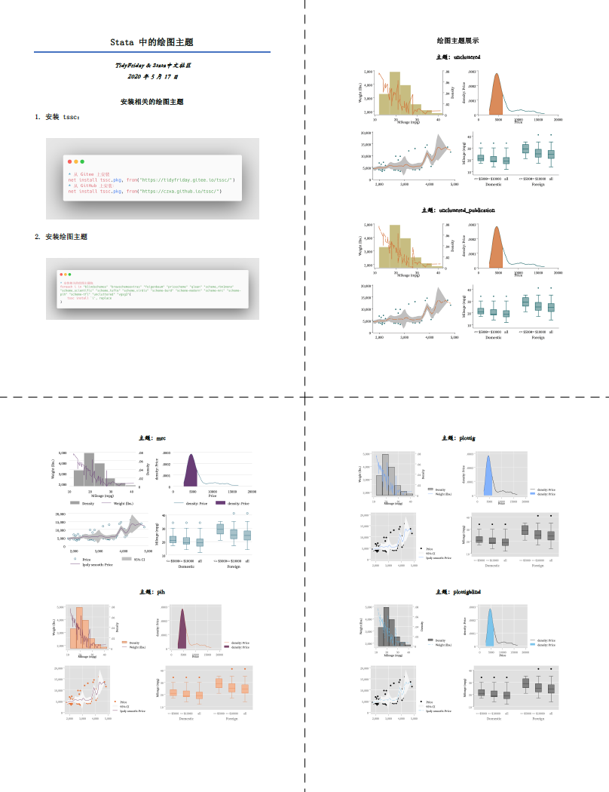

# 这里有 82 个 Stata 绘图主题，你最喜欢那个呢？

> 作者：TidyFriday
> 邮箱：ssc@tidyFriday.cn

Stata 出厂自带几个绘图主题，都挺不好看的。不过，幸运的是，Stata 允许用户自定义绘图主题，本文尽可能地收集了这些第三方绘图主题，合计 82 个。最后我使用 putdocx + 循环创建了一份文档展示这些 Stata 主题。

## 安装 tssc

tssc 命令是我编写的一个小命令，能够很好的解决 ssc 安装 Stata 外部命令缓慢的问题，通过几秒钟就可以完成 Stata 外部命令的安装。我还会经常像里面添加新的 Stata 命令。

安装 tssc：

```stata
* 从 Gitee 上安装
net install tssc.pkg, from("https://tidyfriday.gitee.io/tssc/")
* 从 GitHub 上安装：
net install tssc.pkg, from("https://czxa.github.io/tssc/")
```

两句有一句成功即可。

使用 tssc 安装下面用到的 Stata 绘图主题包：

```stata
* 安装相关的绘图主题包
foreach i in "blindschemes" "brewschemeextras" "feigenbaum" "prioscheme" "qlean" "scheme_rbn1mono" "scheme_scientific" "scheme_tufte" "scheme_virdis" "scheme-burd" "scheme-modern" "scheme-mrc" "scheme-pih" "scheme-tfl" "uncluttered" "vgsg3"{
	tssc install `i', replace
}
```

## 获取 Stata 的主题列表

Stata 的 `graph query, schemes` 命令可以查看所有的主题：

```stata
graph query, schemes

*> Available schemes are

*>     uncluttered
*>     uncluttered_publication
*>     mrc            see help scheme_mrc
*>     pih
*>     plottig        see help scheme_plottig
*>     plottigblind   see help scheme_plottigblind
*>     prio
*>     s2clr_on_white see help scheme_s2clr_on_white
*>     ...省略输出...
```

为了下面的自动化编程，我们再编写一个程序把输出的结果整理成数据集：

```stata
cap log close
log using "schemeslist.smcl", replace smcl
graph query, schemes
log close

infix strL v 1-200 using schemeslist.smcl, clear
keep if index(v, "{col 5}")
replace v = subinstr(v, "{res}", "", .)
gen scheme = ustrregexs(1) if ustrregexm(v, "5\}(.*)")
split scheme, parse("{col 20}")
keep scheme1
ren scheme1 scheme
save scheme, replace
```

这里得到的 scheme.dta 就是包含所有绘图主题名称的数据集了。

下面我们使用 putdocx + 循环生成一个文档展示这些主题的绘图效果，为此我准备了一个组合图表：

```stata
sysuse auto, clear
* 线图 + 直方图
tw histogram mpg, width(5) ysc(alt axis(1)) || /// 
	line weight mpg, yaxis(2) ysc(alt axis(2)) sort ///
	name(a, replace) nodraw scheme(s2color)

* 线图 + 阴影图
sysuse auto, clear
sum price, mean
local mean = r(mean)
qui kdensity price, gen(x h) nodraw
tw line h x || ///
	area h x if x < `mean', name(b, replace) ///
	nodraw scheme(s2color)

* 散点图 + 拟合
tw sc price weight || ///
	lpolyci price weight, name(c, replace) ///
	nodraw scheme(s2color)

* 箱线图
generate order = _n
expand 3
bysort order : generate which = _n
drop if which == 1 & price > 5000
drop if which == 2 & price > 10000
label def which 1 "<= $5000" 2 "<= $10000" 3 "all"
label val which which
gr box mpg, over(which) over(foreign) ///
	name(d, replace) nodraw scheme(s2color)

gr combine a b c d, rows(2) scheme(s2color) xsize(20) ysize(12)
```


## 编写文档展示

注意 **putdocx** 需要 Stata 的版本 > 15.0 。

```stata
* 编写文档
clear all
putdocx begin, pagesize(A4) font("宋体", 14, black)
putdocx paragraph, halign(center) style(Title)
putdocx text ("Stata 中的绘图主题"), bold ///
	font("宋体", 18, black)
putdocx paragraph, halign(center) style(Subtitle)
putdocx text ("TidyFriday & Stata中文社区"), bold font("STKaiti", 12, black) linebreak
putdocx text ("2020 年 5 月 17 日"), bold ///
	font("STKaiti", 12, black) linebreak
putdocx save Stata中的绘图主题.docx, replace

* 安装相关的绘图主题
putdocx begin
putdocx paragraph, halign(center) style(Heading2)
putdocx text ("安装相关的绘图主题"), bold ///
	font("宋体", 14, black)
putdocx paragraph, halign(left) font("宋体", 14, black)
putdocx text ("1. 安装 tssc："), linebreak 
putdocx paragraph, halign(center)
putdocx image "assets/tssc.png", linebreak width(15cm)

putdocx paragraph, halign(left) font("宋体", 14, black)
putdocx text ("2. 安装绘图主题"), linebreak
putdocx paragraph, halign(center)
putdocx image "assets/scheme.png", linebreak width(15cm)

putdocx save Stata中的绘图主题.docx, append

* 使用每个绘图主题绘制一幅图并保存
clear all
use scheme, clear
cap mkdir assets
* vg_size 主题报错，可能这个主题有问题，就删除了它：
drop if scheme == "vg_size"
forval i = 80/`=_N'{
	local scheme = "`=scheme[`i']'"
	cap preserve
	sysuse auto, clear
	qui {
		* 线图 + 直方图
		tw histogram mpg, width(5) ysc(alt axis(1)) || /// 
			line weight mpg, yaxis(2) ysc(alt axis(2)) sort ///
			name(a, replace) nodraw scheme(`scheme')

		* 线图 + 阴影图
		sysuse auto, clear
		sum price, mean
		local mean = r(mean)
		qui kdensity price, gen(x h) nodraw
		tw line h x || ///
			area h x if x < `mean', name(b, replace) ///
			nodraw scheme(`scheme')

		* 散点图 + 拟合
		tw sc price weight || ///
			lpolyci price weight, name(c, replace) ///
			nodraw scheme(`scheme')

		* 箱线图
		generate order = _n
		expand 3
		bysort order : generate which = _n
		drop if which == 1 & price > 5000
		drop if which == 2 & price > 10000
		label def which 1 "<= $5000" 2 "<= $10000" 3 "all"
		label val which which
		gr box mpg, over(which) over(foreign) ///
			name(d, replace) nodraw scheme(`scheme')

		gr combine a b c d, rows(2) scheme(`scheme') xsize(20) ysize(12)
		gr export assets/`scheme'.png, replace
		di in green "`scheme' 绘制成功！"
	}
	restore
}

* 循环插入图片
putdocx begin
putdocx paragraph, halign(center) style(Heading2)
putdocx text ("绘图主题展示"), bold ///
	font("宋体", 14, black)
forval i = 1/`=_N'{
	putdocx paragraph, halign(center) style(Heading3)
	putdocx text ("主题：`=scheme[`i']'"), bold ///
		font("STKaiti", 12, black) linebreak
	putdocx image "assets/`=scheme[`i']'.png", linebreak width(15cm)
}
putdocx save Stata中的绘图主题.docx, append
```

然后就得到了一个 `Stata中的绘图主题.docx` 文件：



这么多 Stata 主题你最喜欢哪个呢？
